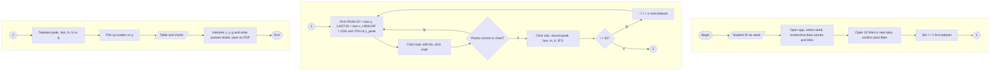

```mermaid
flowchart TD
    subgraph S1[" "]
        A([Begin]) --> B[/Student ID as seed/]
        B --> C[Open app, select seed, screenshot data names and links]
        C --> D[Open 10 links in new tabs, confirm post titles]
        D --> E[Set i = 1 first dataset]
        E --> F(((1)))
    end

    subgraph S2[" "]
        F2(((1))) --> G["Pick PEAK-ID = max y, LAST-ID = last x, LINI/LINF = 25% and 75% of y_peak"]
        G --> H[Click load, edit ids, click read]
        H --> I{Points correct in chart?}
        I -->|N| G
        I -->|Y| J["Click calc, record peak, last, m, b, R^2"]
        J --> K{i = 10?}
        K -->|N| L[i = i + 1 next dataset]
        L --> G
        K -->|Y| M(((2)))
    end

    subgraph S3[" "]
        M2(((2))) --> N[Tabulate peak, last, m, b vs g]
        N --> O[Plot xy-scatter vs g]
        O --> P[/Table and charts/]
        P --> Q[Interpret x, y, g and write answer sheet, save as PDF]
        Q --> R([End])
    end

    classDef default fill:#e6e6fa,stroke:#b0c4de,stroke-width:1px
    classDef sub fill:#ffffe0,stroke:#d3d3d3,stroke-width:1px
    class S1,S2,S3 sub
```
