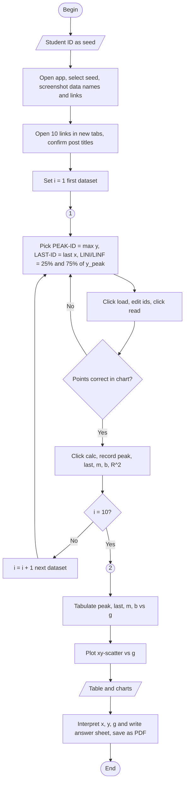

```mermaid
graph TD
    A([Begin]) --> B[/Student ID as seed/]
    B --> C[Open app, select seed, screenshot data names and links]
    C --> D[Open 10 links in new tabs, confirm post titles]
    D --> E[Set i = 1 first dataset]
    E --> F((1))

    F --> G["Pick PEAK-ID = max y, LAST-ID = last x, LINI/LINF = 25% and 75% of y_peak"]
    G --> H[Click load, edit ids, click read]
    H --> I{Points correct in chart?}
    I -->|No| G
    I -->|Yes| J["Click calc, record peak, last, m, b, R^2"]
    J --> K{i = 10?}
    K -->|No| L[i = i + 1 next dataset]
    L --> G
    K -->|Yes| M((2))

    M --> N[Tabulate peak, last, m, b vs g]
    N --> O[Plot xy-scatter vs g]
    O --> P[/Table and charts/]
    P --> Q[Interpret x, y, g and write answer sheet, save as PDF]
    Q --> R([End])
```
